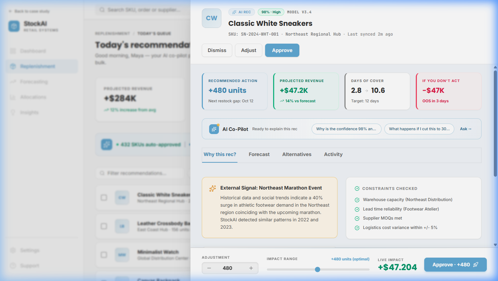

# StockAI Replenishment

> **A Senior Product Designer challenge for [Foundey](https://foundey.notion.site/StockAI-Senior-PD-Role-2ce63a9715d281eba97ff4b51db980af).** Four days. One feature redesigned end to end. Solo PM and design.

[](https://stock-ai-henna.vercel.app)
[](https://react.dev)
[](https://tailwindcss.com)
[](LICENSE)



---

## What this is

A redesigned replenishment feature for StockAI, an inventory management platform. Existing recommendations were opaque numbers Maya the inventory manager had to trust blindly. The redesign turns each recommendation into a transparent co-pilot interaction: every rec carries its reasoning, signals with weights, constraints checked, past similar decisions, alternative scenarios, and complete activity history.

## What you'll find here

- **`/`** — Apple-style case study site walking through the redesign process
- **`/app`** — The actual production build of the redesigned feature, embedded as iframe in the case study and accessible directly

This is not a Figma prototype. The live product is a real React application deployed on Vercel.

## Why it exists

The original StockAI flow walked users through three screens to approve one recommendation. Inventory managers like Maya don't have time for that — she manages 1,200 SKUs across 8 warehouses. She had been burned by AI tools recommending six months of summer dresses in October. The Excel sheet she built that weekend in 2023 was still her source of truth.

The brief: redesign the replenishment feature. The thesis: make AI recommendations transparent enough to approve in 90 seconds, not spreadsheet hours.

Read the full case study at [stockai-replen.vercel.app](https://stock-ai-henna.vercel.app).

## Tech stack

| Layer | Choice | Why |
|-------|--------|-----|
| Framework | React 19 + Vite | Fast HMR, modern React features, low overhead |
| Language | TypeScript | Catch errors at compile, document component contracts |
| Styling | Tailwind v4 | Utility-first speed, design tokens via @theme |
| Components | shadcn/ui | Accessible primitives, copy-paste customization |
| State | Zustand | Lighter than Redux, no boilerplate, perfect for this scale |
| Routing | React Router v6 | Standard SPA routing |
| Animation | Framer Motion | Spring transitions for the AI strip and lightbox |
| Notifications | Sonner | Toast with undo for approve/dismiss actions |
| Icons | Lucide React | Consistent line icons, 1.5px stroke for refined look |
| Hosting | Vercel | Zero-config, edge network, automatic SSL |

## Architectural decisions

A few key calls worth explaining:

### Why mock AI instead of a real LLM call?

The brief asks for the design of an AI-driven feature, not the AI itself. Wiring up Claude or GPT would add latency, cost, and complexity without proving anything about the design. The mock AI in `src/lib/mock-ai/` simulates routing, response trees, streaming, and tone variation — enough fidelity to demonstrate the UX without the production overhead.

### Why a drawer instead of a separate page for deep review?

Inventory managers triage queues. A separate route would force a full navigation away from the dashboard, breaking flow when reviewing a queue of 47 recommendations. The drawer keeps the queue visible behind it, supports back-to-back review without cognitive reset, and naturally accommodates the "approve, dismiss, adjust" pattern.

### Why iframe the live product into the case study?

Recruiters want proof. A static screenshot in a Figma prototype shows the design but not that it works. Embedding the live `/app` route as an iframe in the Hi-fi section of the case study lets recruiters click through the actual deployed product without leaving the case study narrative. The iframe is sandboxed for security and lazy-loads to keep the case study lightweight.

### Why mobile fallback on `/app` instead of full responsive?

The drawer is 880px wide. Making it work at 320px would require redesigning it as a stacked vertical layout, with the dashboard table becoming horizontally scrollable, with the AI strip becoming a bottom sheet. That's a fundamentally different design. For a 4-day brief, a clean "best viewed on desktop" message is the honest call. Production teams ship enterprise B2B SaaS with this exact pattern (Linear, Airtable, Notion).

### Why Zustand instead of Redux or Context?

Two stores, both small (recommendations + UI state). Redux would add 200+ lines of boilerplate for actions/reducers/middleware. Context with useReducer would re-render the whole tree on any change. Zustand gives me selectors, no boilerplate, and atomic re-renders. Right tool for this scale.

## Project structure

```
src/
├── pages/                    # Top-level routes
│   ├── CaseStudyPage.tsx
│   └── AppPage.tsx
├── components/
│   ├── case-study/           # Marketing site sections
│   │   ├── HeroSection.tsx
│   │   ├── ProblemSection.tsx
│   │   ├── AuditSection.tsx
│   │   ├── UserFlowSection.tsx
│   │   ├── LoFiSection.tsx
│   │   ├── HiFiSection.tsx
│   │   ├── OutcomesSection.tsx
│   │   ├── Footer.tsx
│   │   ├── StickyTopNav.tsx
│   │   └── shared/
│   │       ├── ExpandableSection.tsx
│   │       └── Lightbox.tsx
│   ├── app/                  # Live product
│   │   ├── dashboard/
│   │   ├── drawer/
│   │   │   └── tabs/
│   │   ├── ai-copilot/
│   │   ├── dialogs/
│   │   └── layout/
│   └── ui/                   # shadcn primitives
├── lib/
│   ├── store.ts              # Zustand global state
│   ├── mock-data.ts          # 8 SKU recommendations (apparel)
│   ├── mock-ai/              # Co-pilot simulation
│   └── utils.ts
└── index.css                 # Tailwind v4 theme + global styles
```

## Local development

Requirements: Node 20+, npm 10+.

```bash
git clone https://github.com/luigisimoes/StockAI.git
cd StockAI
npm install
npm run dev
```

Open [http://localhost:3000](http://localhost:3000) in a desktop browser. The case study loads at `/`, the live product at `/app`.

### Available scripts

```bash
npm run dev       # Vite dev server with HMR
npm run build     # Production build to dist/
npm run preview   # Preview production build locally
```

## Honest limitations

This is a 4-day design challenge, not a production-ready app. A few things to know:

- **No backend.** All AI responses, recommendations, and persistence are mocked client-side. Refreshing resets state.
- **No auth.** Anyone can navigate to `/app` and "approve" recommendations. The Reset Demo button in the avatar dropdown clears state.
- **Mobile fallback.** `/app` shows a "best viewed on desktop" message under 768px. Intentional, see architectural decisions above.
- **8 SKUs only.** The mock data covers 8 apparel recommendations representing different categories (high-impact restocks, overstocks, low-confidence cold starts).
- **AI is a simulation.** The "thinking..." delay, streaming response, and tone variation are scripted. Real production would route to an LLM.

## Outcomes (hypothesis, not proof)

These benchmarks come from public retail case studies and are NOT measurements of this prototype. They are the targets the redesign is built to hit.

| Metric | Target | Source |
|--------|--------|--------|
| Replenishment time reduction | 75% | Hackett Group with Nextail, 2023 |
| Stockout drop after AI rollout | 24% | River Island with Nextail, 18-month case study |
| Gross margin uplift | 1.2 to 1.9 pts | Bain and Company, AI in retail, 2024 |

A real validation would require A/B testing in production against an inventory manager's actual queue. The proof is downstream of this brief.

## Credits and contact

Built by **Luigi Simões** for the Foundey Senior Product Designer challenge.

- Portfolio: [luigi.is](https://luigi.is)
- Email: [luigiproduct@gmail.com](mailto:luigiproduct@gmail.com)
- LinkedIn: [linkedin.com/in/luigisimoes](https://linkedin.com/in/luigisimoes)

## License

MIT — see [LICENSE](LICENSE) for details.
